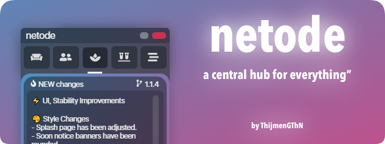

<br />
<p align="center">
  <a href="https://github.com/ThijmenGThN/netode">
    
  </a>
  <br />
  
  <br />
  <a href="https://github.com/ThijmenGThN/netode">
    
  </a>
  <p align="center">
    <a href="https://github.com/ThijmenGThN/netode/releases"><strong>Releases & Installation for Windows »</strong></a>
  </p>
</p>
<br />

## Developers 🔨

```
1. Dependencies
 - $ npm i

2. Development
 - $ npm run electron:dev

3. Deployment
 - > Edit: package.json -> version
 - $ npm run electron:build
```
